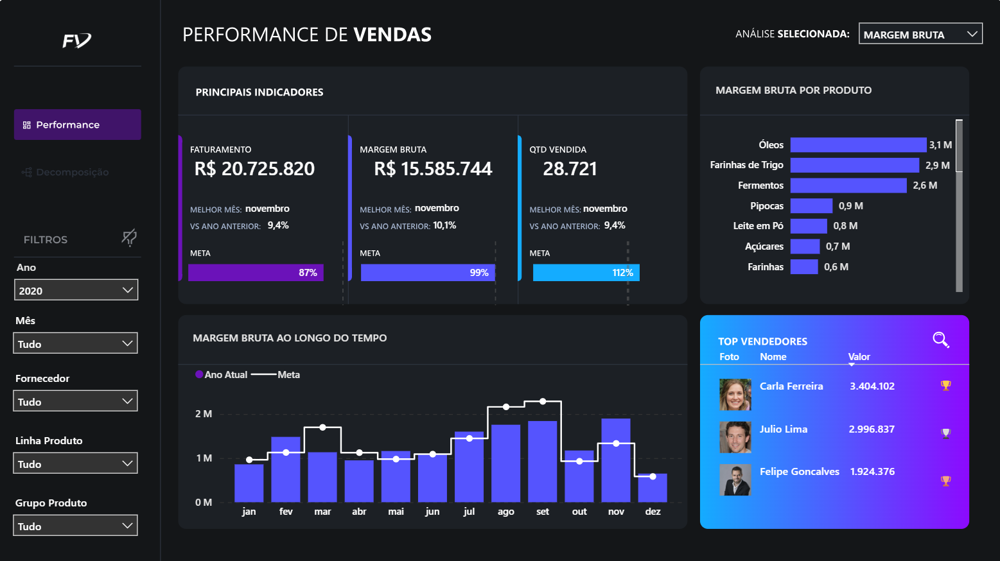
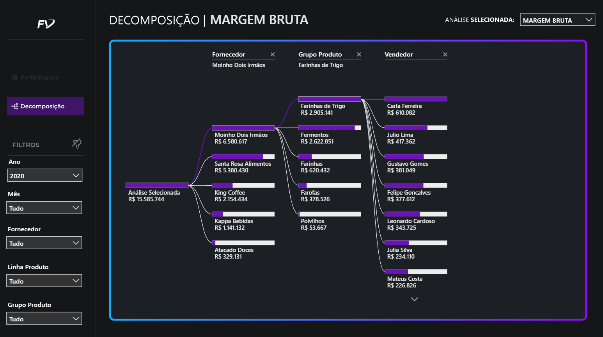

# 📊 Dashboard de Vendas no Power BI

## 📌 Visão Geral do Projeto

Este projeto consiste no desenvolvimento de um dashboard interativo em Power BI voltado para a análise de performance de vendas.

A solução permite acompanhar indicadores estratégicos como faturamento, margem bruta e volume de vendas, além de comparar resultados com metas e identificar os principais fatores que impactam o desempenho comercial.

O foco do projeto foi transformar dados operacionais em insights acionáveis, reduzindo a dependência de análises manuais e apoiando a tomada de decisão baseada em dados.

---

## 📊 Dataset

**Fonte:** Base disponibilizada pela Xperiun

O dataset foi organizado em múltiplas tabelas relacionais, permitindo análises integradas entre vendas, produtos, vendedores e metas.

As principais informações incluem:

* **Vendas**
  Dados transacionais contendo faturamento, quantidade vendida e informações temporais para análise de performance ao longo do tempo

* **Produtos**
  Informações sobre produtos e categorias, possibilitando análise de mix, concentração de receita e margem

* **Vendedores**
  Dados da equipe comercial, permitindo avaliação de desempenho individual e comparação entre vendedores

* **Metas**
  Definição de metas comerciais, possibilitando análise de atingimento e acompanhamento de resultados

O modelo foi estruturado seguindo o conceito de **tabela fato (vendas)** e **tabelas dimensão (produtos, vendedores e metas)**, permitindo análises dinâmicas e escaláveis no Power BI.

---

## 🎯 Contexto de negócio

Empresas que atuam com vendas frequentemente enfrentam dificuldades para acompanhar a performance comercial de forma clara e acionável.

Apesar de possuírem dados de faturamento, margem e volume de vendas, esses dados muitas vezes estão dispersos e não estruturados para responder perguntas críticas como:
	•	Estamos atingindo nossas metas?
	•	Quais fatores estão impulsionando ou prejudicando os resultados?
	•	Onde estão as maiores oportunidades de crescimento?
	•	Quem são os principais responsáveis pelo desempenho comercial?

A ausência de uma visão integrada dificulta a tomada de decisão estratégica e reduz a capacidade de reação a desvios de performance.

---

## 🚀 Objetivo do projeto

Desenvolver um dashboard interativo capaz de:

* Monitorar a performance de vendas de forma clara e dinâmica
* Comparar resultados com metas estabelecidas
* Identificar padrões e variações ao longo do tempo
* Explorar fatores que impactam faturamento e margem
* Apoiar a tomada de decisão baseada em dados

---

## 🧠 Metodologia

O desenvolvimento do projeto seguiu uma abordagem estruturada de análise de dados, passando por etapas de preparação, modelagem, criação de métricas e construção das análises.

### 🔹 1. Coleta e entendimento dos dados

Os dados foram importados para o Power BI a partir de múltiplas tabelas (vendas, produtos, vendedores e metas), representando um cenário comercial completo.

Nesta etapa, o foco foi compreender:

* A estrutura das tabelas
* O significado das variáveis
* As possíveis análises que poderiam ser realizadas

---

### 🔹 2. Tratamento e preparação dos dados

Foi realizado o processo de limpeza e padronização dos dados, incluindo:

* Remoção de registros inconsistentes ou inválidos
* Ajuste de tipos de dados (datas, valores numéricos, textos)
* Padronização das colunas para garantir consistência nas análises

Essa etapa foi fundamental para garantir a confiabilidade dos resultados.

---

### 🔹 3. Modelagem de dados

A modelagem foi estruturada para suportar análises dinâmicas e escaláveis:

* Criação de uma **tabela calendário** para viabilizar análises temporais
* Definição de relacionamentos entre tabela fato (vendas) e dimensões (produtos, vendedores e metas)
* Organização do modelo seguindo boas práticas de BI

---

### 🔹 4. Criação de colunas calculadas

Foram criadas colunas auxiliares para enriquecer a análise, como:

* Cálculo de custo por venda
* Apoio na construção de métricas mais complexas

---

### 🔹 5. Desenvolvimento de métricas (DAX)

Foi criada uma estrutura robusta de medidas utilizando DAX, organizadas em uma tabela dedicada para melhor manutenção e escalabilidade.

As principais categorias de métricas incluem:

* **KPIs principais**

  * Faturamento
  * Margem Bruta
  * Notas Emitidas
  * Ticket Médio

* **Comparativos temporais**

  * Faturamento vs Ano Anterior
  * Margem vs Ano Anterior
  * Notas vs Ano Anterior

* **Atingimento de metas**

  * % Meta de Faturamento
  * % Meta de Margem
  * % Meta de Notas

* **Métricas dinâmicas**

  * Uso de SWITCH para alternar indicadores
  * Medida selecionada para análise interativa
  * KPI dinâmico baseado na escolha do usuário

* **Análises complementares**

  * Ranking de vendedores
  * Identificação de melhores meses (faturamento, margem e volume)
  * Indicadores de performance

---

### 🔹 6. Construção do dashboard

Foram desenvolvidas visualizações focadas em análise e tomada de decisão:

* Gráficos de evolução temporal
* Comparação entre realizado vs meta
* Ranking de desempenho
* Análise por produto, vendedor e período
* Visualizações interativas com seleção dinâmica de métricas

O dashboard foi projetado para permitir exploração intuitiva dos dados e identificação rápida de insights.

---

## 📌 Abordagem geral

O projeto foi conduzido com foco em transformar dados em informação estratégica, combinando:

* Modelagem eficiente
* Uso avançado de DAX
* Visualizações orientadas a negócio

O resultado é um dashboard que não apenas apresenta dados, mas **responde perguntas relevantes e apoia decisões comerciais**.

---

## 🛠️ Ferramentas utilizadas

* Power BI
* DAX (Data Analysis Expressions)

---

## 📁 Estrutura do repositório

```text
assets/
├── img/
│   ├── 01-visao-cliente.png
│   ├── 02-comportamento-gasto.png
│   └── 03-performance-campanhas.png
└── pdf/
    └── relatorio-powerbi-vendas.pdf
```

---

## 📸 Dashboard

### Link do Dashboard:
https://app.powerbi.com/view?r=eyJrIjoiMDVjNmQwNWYtNmUzMS00YWYwLTk3NzUtY2JkNzlkYTg1MWVjIiwidCI6Ijk4YjAyZTQ5LWU1NzEtNGZjYi1hODBjLTBiMTA3Y2E0YzdkMCJ9

### Visão geral da performance



### Análise de Decomposição



---

## 📊 Principais insights

* Alta concentração de faturamento e margem em poucos produtos (óleos, farinhas e fermentos), indicando risco de dependência e oportunidade de diversificação
* Identificação de fornecedores com grande impacto nos resultados, permitindo negociações mais estratégicas
* Destaque para vendedores com melhor performance, possibilitando replicação de boas práticas
* Produtos com baixa contribuição de margem, indicando necessidade de revisão de preços ou portfólio
* Sazonalidade nas vendas, com melhor desempenho no segundo semestre

---

## 📄 Relatório completo

Acesse o relatório completo em PDF:

👉 [Download do relatório](assets/pdf/dashboard-vendas-powerbi)

---

## 📌 Conclusão

Este projeto demonstra como a combinação de **modelagem de dados + DAX + visualização estratégica** pode transformar dados brutos em informações relevantes para o negócio.

Mais do que um dashboard, trata-se de uma ferramenta de apoio à decisão, capaz de identificar padrões, riscos e oportunidades de crescimento.

---

## 👨‍💻 Autor

Felipe Vilela
[LinkedIn](https://linkedin.com/in/felipe-vilela-594372362/)
